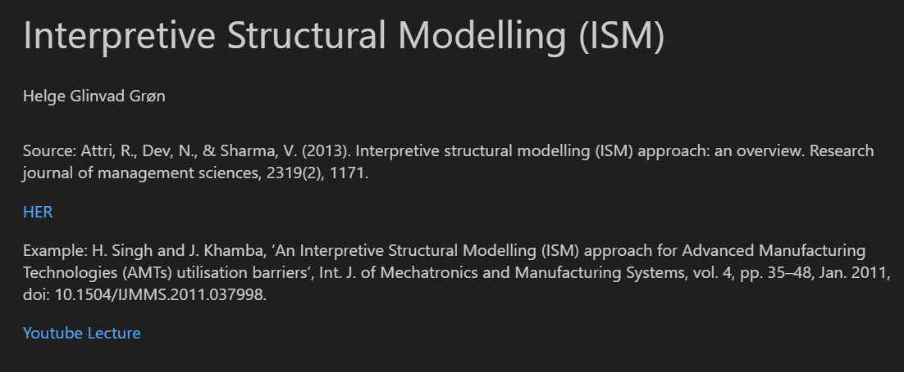
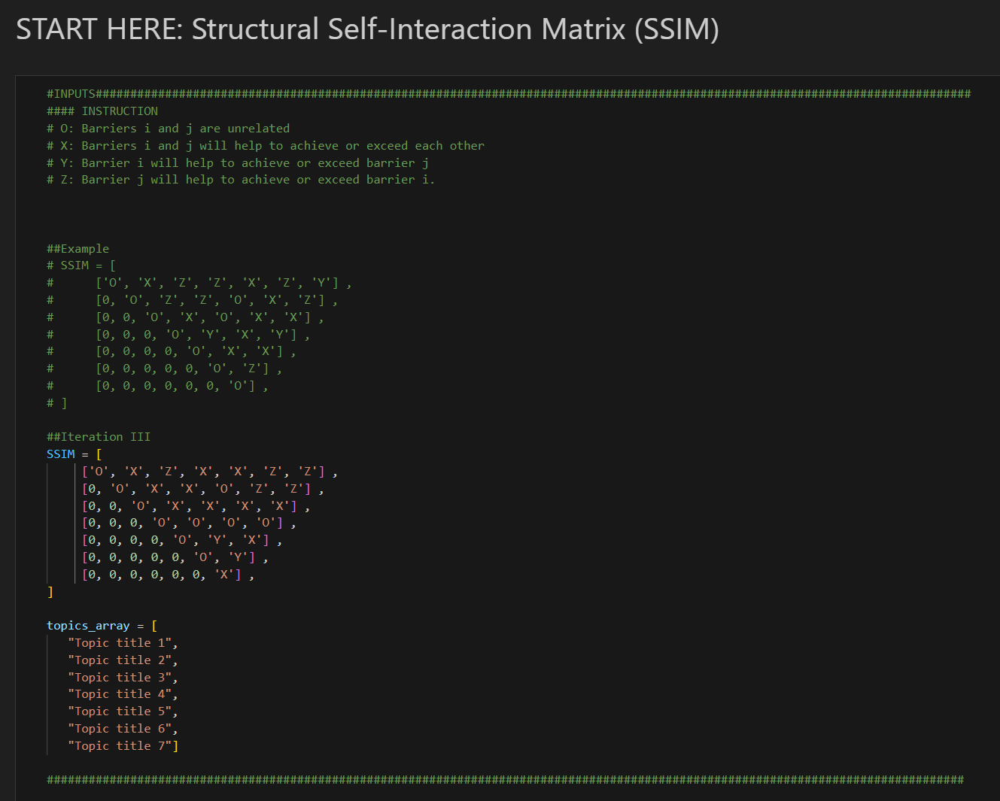
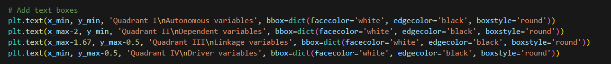
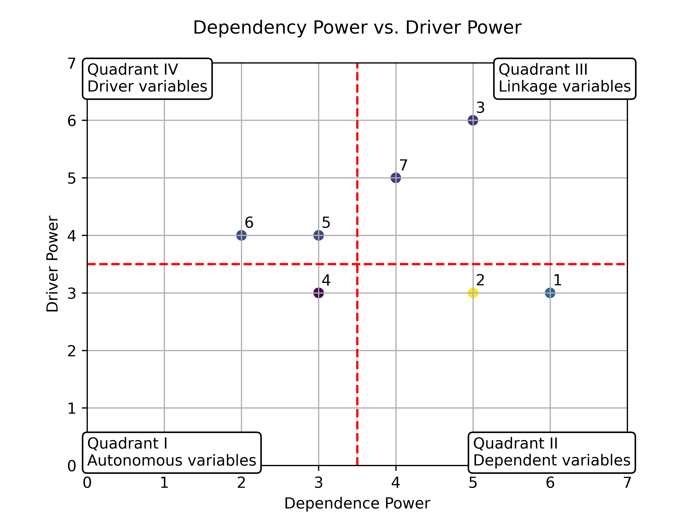
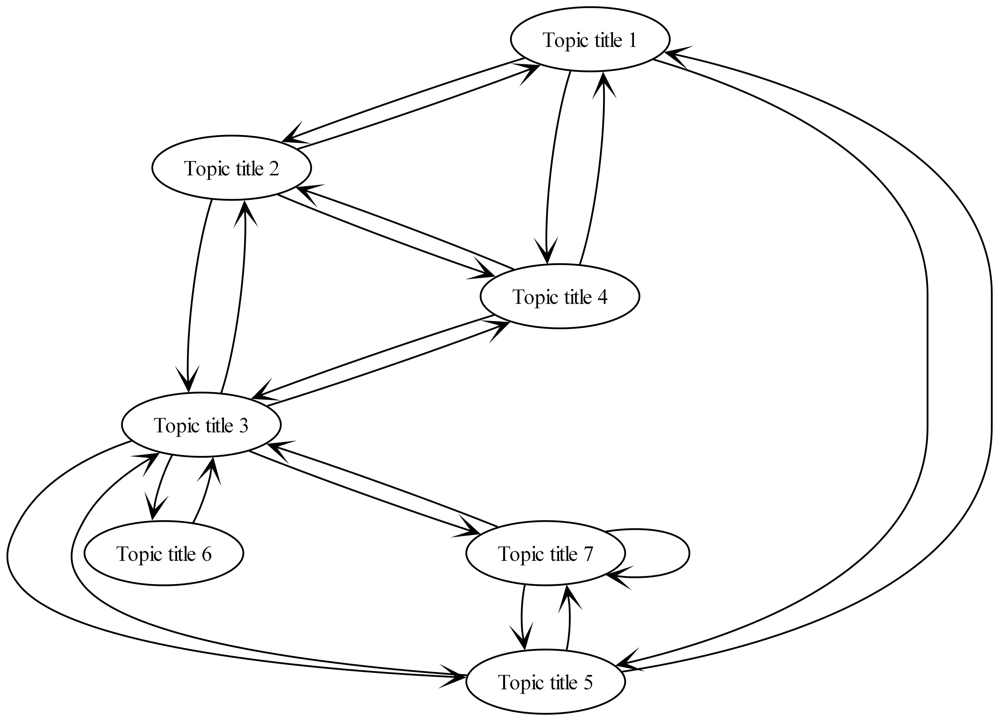
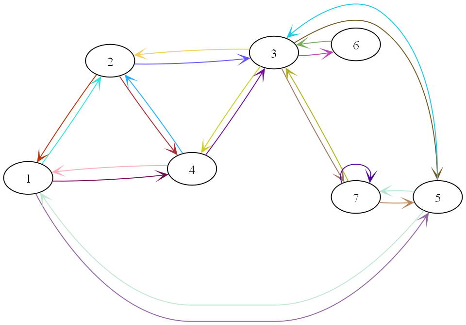
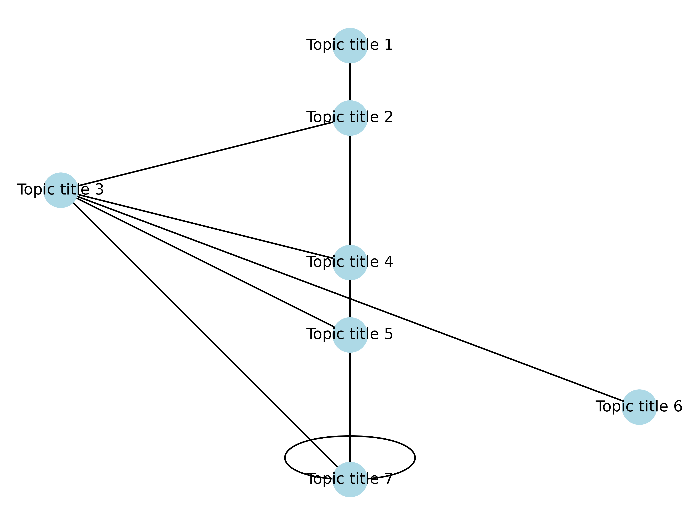

# ISM
Interpretive Structural Modelling (ISM) - Writen in Pyhton and uses JubiterNotebook

**Uploaded and tested using Python Version**
3.11.3

# Welcome


Welcome to this JubiterNotebook, step-by-step code for doing and generating figures from an SSIM Matrix.

To use the code, you will need to change two matrixs, see the picture below



The SSIM should be filled out with the letters: O, X, Z or Z
````
#### INSTRUCTION
# O: Barriers i and j are unrelated 	
# X: Barriers i and j will help to achieve or exceed each other 	
# Y: Barrier i will help to achieve or exceed barrier j 	
# Z: Barrier j will help to achieve or exceed barrier i.	
````
an example of a 7 barrier, SSIM matrix can be seen in the code
````
SSIM = [
     ['O', 'X', 'Z', 'X', 'X', 'Z', 'Z'] ,
     [0, 'O', 'X', 'X', 'O', 'Z', 'Z'] ,
     [0, 0, 'O', 'X', 'X', 'X', 'X'] ,
     [0, 0, 0, 'O', 'O', 'O', 'O'] ,
     [0, 0, 0, 0, 'O', 'Y', 'X'] ,
     [0, 0, 0, 0, 0, 'O', 'Y'] ,
     [0, 0, 0, 0, 0, 0, 'X'] ,
]
````

To use the code, and generate the figures and tables from the ISM recipe, the topic_array, needs to be filled out with the names of the barriers.
````
topics_array = [
   "Topic title 1",
   "Topic title 2",
   "Topic title 3",
   "Topic title 4",
   "Topic title 5",
   "Topic title 6",
   "Topic title 7"
]
````

if smaller or biggere SSIM are need the two matrixs needs to be extended, and the figure from the Driving-Dependencies plot needs to be fixed, this can be seen on the following picture.


The JubiterNotebook have been generate for OpenAccess journal publication, therefore is it also only naturale that the tools used are public.

# Example of figures from the code

Dependency Power vs Driver Power plot:


Digraph:


Digraph with colors:


ISM model:



**As always... Have fun with the data and code**
